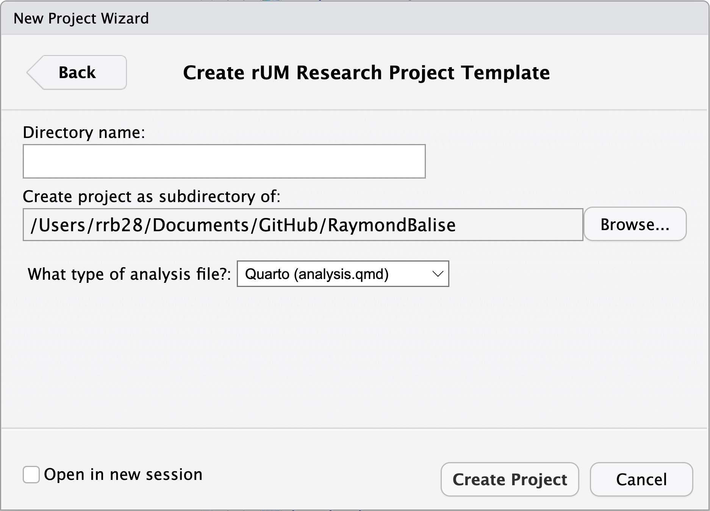

```{r setup, echo = FALSE}
knitr::opts_chunk$set(include = TRUE)

source("./assets/color_funs.R")

xaringanExtra::use_tile_view()
```

```{r, eval=FALSE, echo=FALSE}
# make pdf of slides
xaringanBuilder::build_pdf("./02_examples.Rmd")
```

```{r, echo=FALSE}
# Helper packages - need dplyr and ggplot
library(conflicted)
suppressMessages(conflict_prefer("select", "dplyr"))
suppressMessages(conflict_prefer("filter", "dplyr"))
suppressPackageStartupMessages(library(tidyverse))
library(ggthemes)

suppressPackageStartupMessages(library(tidymodels))
tidymodels_prefer()

library(knitr)

remotes::install_github("hadley/emo", quiet = TRUE)
```


class: segue

Infectious Disease Elimination Act

---
# Intersecting Epidemics

+ HIV
+ hepatitis C
+ overdose deaths

---
.pull-left[


]


.pull-right[]

???
downloaded 2023-03-03
https://map.aidsvu.org/map
https://www.cdc.gov/hepatitis/statistics/2018surveillance/HepC.htm 

---

.center[

]

---

.center[

]

---
# Harm Reduction

.center[
https://www.youtube.com/watch?v=ldTxMIblePk

<iframe src="https://www.youtube.com/embed/ldTxMIblePk" title="One Doctor’s Needle Fix" frameborder="0" allow="accelerometer; autoplay; clipboard-write; encrypted-media; gyroscope; picture-in-picture; web-share"  allowfullscreen></iframe>
]

---
# NIDA Videos


.center[
Addressing Barriers to Care

https://www.youtube.com/watch?v=2d_3DqMEdEg

What is Harm Reduction?

https://www.youtube.com/watch?v=ikmKxgCTXFA


Caring for People Who Use Drugs

https://www.youtube.com/watch?v=7RI72zvO2dU

]

---
# IDEA Syringe Services Program

+ The Infectious Disease Elimination Act (IDEA) of 2016 was signed into law on July 1, 2016.
+ This policy authorized the University of Miami to open the .red[first] legal syringe services program (or .red[needle exchange]) in the state of .red[Florida]
    + decriminalized possession and distribution of syringes for those engaged in the program
    + 5-year, unfunded pilot project, set to end in July, 2021

+ Prior to implementation, REDCap was used to build a data collection system to evaluate the pilot program with the sole purpose of .red[providing data to the legislature] to enhance advocacy efforts for statewide expansion of the program.

---
class: segue

Infectious Disease Elimination Act - REDCap

---
# Current Database

+ More than 2100 people have been helped.
+ Lessons Learned
   + Fixed vs. mobile sites had similar but not identical variables.
   + Services variables were added.
   + Questions were added and some dropped.
   + Not all variables were validated.
+ Using new features in REDCap
   
   
---
# New Version for the Other Sites

.pull-left[
+ a .red[single, fixed/mobile] project for each county
+ .red[Multiple instruments] in the project
+ follows `tidyverse` naming convention
+ removes .red[dropped content]
+ .red[Validation] on all text
+ numeric .red[calculated fields] 
  + for needle supply by size
+ .red[Calculated text] and hidden fields using action tags
]
.pull-right[
+ .red[Automatic alerts] for testing (HIV/Hep C)
  + referrals (smart variables for latest info)
+ added .red[supply tracking] (not shown here)
+ greatly improved .red[aesthetics] & .red[organization]
    + Custom HTML/CSS
    + Field embedding
+ .red[Data Access Groups] for locations in a county
]
    
---
# Show and Tell - Designer


---
# Show and Tell - Repeated


---
# Show and Tell - Add Typical


---
# Show and Tell - Add


---
# Show and Tell - Enrollment

.scroll-box-18[

]

---
# Show and Tell - Enrollment

.scroll-box-18[
.center[

]
]


---
# Show and Tell - Daily

.scroll-box-18[
.center[

]]

---
# Show and Tell - Naloxone

.scroll-box-18[
.center[

]]

---
# Before and After Field Embedding

.pull-left[
.scroll-box-16[

]
]
.pull-right[

]

---
# Field Embedding with Branching Logic

* Add all the fields that may appear.
* Add a Descriptive Text field.
* Design the appearance with *What You See Is What You Get* (WYSIWYG) tools. 
    + *Rich Text Editor* controls for text and drawing grids
    + Embed variables in the grid with `{thingy}` references

---
# Field Embedding with Branching Logic

.scroll-box-18[
.center[

]]

---
# WYSIWYG - Pretty Data Collection

.scroll-box-18[
.center[

]]

---
class: segue

Integrating with R


---
# `rUM`

+ I teach in a medical school (i.e., smart people who are not programmers).
+ I teach `r` at `UM`, so to support my students, I give them .blue[`rUM`].
+ It has menu-driven tools to add `R Markdown` code or to add complete projects.
+ The projects contain:
    + Quarto or R Markdown paper shells for manuscripts
        + full-featured YAML header
        + code to add used packages to the paper bibliography
    + an aggressive .gitignore file
    + a data folder
    
---
# .blue[`rUM`] Uses Posit's Brilliance

+ .blue[`rUM`] uses the Quarto and R Markdown magic that Yihui Xie and his colleagues at Posit/RStudio and around the world have created.

.center[
<https://quarto.org/>
]

.pull-left[
.center[

<br/>
[R Markdown: The Definitive Guide](https://bookdown.org/yihui/rmarkdown/)
]]
.pull-right[
.center[

<br/>
[R Markdown Cookbook](https://bookdown.org/yihui/rmarkdown-cookbook/)  
]]

---
# Using .blue[`rUM`]  

+ Install with .blue[`remotes::install_cran("rUM")`] or .blue[`install.packages("rUM")`].
+ Completely stop and restart all your instances of RStudio. There are hooks into the graphical user interface, so you need a FULL restart. Expect problems if you just try to restart R.

---
# Add a Splash of .blue[`rUM`]

+ .blue[`rUM`] has a bunch of .red[headers] that include YAML and setup instructions. A header is setup code that "always" appears at the top of a program.

.pull-left[
1)  From the RStudio file menu, choose R Markdown...


]
.pull-right[
2) Choose From Template and then choose "html2 with rUM":


]

---

.scroll-box-18[

]

---
# Make a .blue[`rUM`] Infused Project

.pull-left-36[


]

.pull-right-60[


```{r, eval=FALSE}
rUM::make_project(
  path,
  type = c("Quarto (analysis.qmd)", "R Markdown (analysis.Rmd)")
)
```
]

---


---
.pull-left[
### R Markdown

]

.pull-right[
### Quarto

]

---
# The Default Ouput

.center[

]

---
# Visual Editor to Do Stuff

.pull-left[
+ point-and-click formatting
+ basic tables
+ images 
+ add references/citations

In the Visual Editor, typing .red[⌘ /] on Mac or .red[cmd /] on Linux/Windows is very useful.

]
.pull-right[
.center[

]
]

---
# The Bibliography

+ The bibliography section of the template has code to find the packages used in the R Markdown or Quarto file and add them to the "packages.bib" file.


```
# automatically create a bib database for loaded R packages & rUM
knitr::write_bib(
  c(
    .packages(),
    "rUM",
    "table1"
  ),
  "packages.bib"
)
```

---
# Use Package

+ Say you add .blue[`library(tidymodels)`] to your analysis file.
+ After you "knit" or "render" once, the package details will be added to the "packages.bib" file.  

.center[

]

---
class: hide-slide-number

# Reference It

+ You can copy and paste the reference examples that are in the *Methods* (or point and click) to add it to the text in your methods section.

.pull-left[


]

.pull-right[

]

---
# Reference Style

By default, the style is set to be New England Journal of Medicine.  That is controlled by one line in the YAML header 

```
csl: the-new-england-journal-of-medicine.csl
```

and a details file that you can get from here: https://www.zotero.org/styles
.center[

]
Save the CSL file into the project directory and tweak the YAML.

---
# .gitignore 

+ I teach workflows that use git and GitHub to students in the medical school.  So `rUM` infused projects include my very aggressive **.gitignore** file.  It attempts to block common dataset formats (Excel, Python, R, SAS, SPSS, STATA, text, and zip files). Take a look and tell me if I am missing anything.

.scroll-box-18[
```
# Version 2022-08-12

# History files
.Rhistory
.Rapp.history

# Session Data files
.RData
*.RData

# User-specific files
.Ruserdata

# Example code in package build process
*-Ex.R

# Output files from R CMD build
/*.tar.gz

# Output files from R CMD check
/*.Rcheck/

# RStudio files
.Rproj.user
.Rproj.user/

# produced vignettes
vignettes/*.html
vignettes/*.pdf

# OAuth2 token, see https://github.com/hadley/httr/releases/tag/v0.3
.httr-oauth

# knitr and R markdown default cache directories
*_cache/
/cache/

# Temporary files created by R markdown
*.utf8.md
*.knit.md

# R Environment Variables
.Renviron

# Mac
.DS_Store
.Thumbs.db
Thumbs.db

# R projects 
*.Rproj

# Directories
docs/
data/
development/
macros/
output/
sasdata/
libs/

# Exclude .Rmd output
*.html
**/figure-html/

# Exclude Text
*.txt
*.Txt
*.TXT

# Exclude Excel
*.xlsx
*.xls

# R data
*.rds
*.RDS
*.Rds
*.rda
*.RDA
*.Rda

# csv data
*.csv
*.CSV
*.Csv

# sas data
*.sas7bdat
*.sas7bcat

# SPSS data
*.sav
*.SAV
*.Sav

# SPSS output
*.spv
*.SPV
*.Spv

# STATA data
*.dta
*.DTA
*.Dta

# STATA log files
*.log
*.LOG
*.Log
*.smcl
*.SMCL
*.Smcl

# data commonly used in Python
*.json
*.pkl
*.h5
*.msgpack
*.parquet
*.feather

# VSC
www/.vscode/

# Bookdown book
_book/
_bookdown_files/

# Binary - Powerpoint and iThoughtsX
*.ppt
*.pptx
*.itmz

# R packages
*.tar

# Archives
*.zip
*.Zip
*.ZIP

# Quarto
/.quarto/
/_site/
.quarto/
_site/
```
]

---
class: segue

REDCap R Packages/Tools

---
# Summary of REDCap Processing Packages - History

+ Info was current on May 29th, 2023.

```{r history, echo=FALSE}
dates <- tribble(
  ~` `,                        ~tidyREDCap,  ~REDCapDM,    ~REDCapTidieR, ~REDCapExporter,
  "CRAN Downloads",            "15,207",     "1,618",      "2,390",       "15,840",
  "First CRAN Release",        "2020-01-14", "2022-12-22", "2022-09-21",  "2019-12-22",
  "Latest CRAN Release Date",  "2023-05-29", "2023-03-31", "2023-05-18",  "2021-02-02",
  "Latest GitHub Update Date", "2023-05-29", "2023-03-31", "2023-05-26",  "2021-03-05",
  ) |> 
  select(` `, REDCapExporter, tidyREDCap, REDCapTidieR, REDCapDM)

dates |> 
  kable()
```


---
class: hide-slide-number

# Summary of REDCap Processing Packages

.smaller[
```{r features, echo=FALSE}
features <- tribble(
  ~`Feature`,                                            ~tidyREDCap,      ~REDCapDM,           ~REDCapTidieR,       ~REDCapExporter,
  "API Export Project into a R package",                emo::ji("x"),     emo::ji("x"),        emo::ji("x"),        emo::ji("check"),
  "Manually Export and Load into R",                     emo::ji("check"), emo::ji("check"),    emo::ji("x"),        emo::ji("x"),
  "API Export a Single Table",                           emo::ji("check"), emo::ji("x"),        emo::ji("x"),        emo::ji("x"),
  "API Export All Tables",                               emo::ji("check"), emo::ji("check"),    emo::ji("check"),    emo::ji("x"),
  "Use/Show Field Labels",                               emo::ji("check"), emo::ji("check"),    emo::ji("check"),    emo::ji("x"),
  "Summary Tables Choose One Questions",                 emo::ji("check"), emo::ji("x"),        emo::ji("x"),        emo::ji("x"),
  "Summary Tables Choose All Questions",                 emo::ji("check"), emo::ji("x"),        emo::ji("x"),        emo::ji("x"),
  "Convert Checked/Unchecked to Yes/No Yes/No/Unknown",  emo::ji("check"), emo::ji("x"),        emo::ji("x"),        emo::ji("x"),
  "Tools for Querying Logical Expressions",              emo::ji("x"),     emo::ji("check"),    emo::ji("x"),        emo::ji("x"),
  "Tools for Counting Longitudinal Events",              emo::ji("x"),     emo::ji("check"),    emo::ji("x"),        emo::ji("x"),
  "Recalcualte Calculated Fields",                       emo::ji("x"),     emo::ji("check"),    emo::ji("x"),        emo::ji("x"),
  "Split Data by Event/Form",                            emo::ji("x"),     emo::ji("check"),    emo::ji("x"),        emo::ji("x"),
  "Summarize Metadata",                                  emo::ji("x"),     emo::ji("x"),        emo::ji("check"),    emo::ji("x"),
  "Convert to Excel",                                    emo::ji("x"),     emo::ji("x"),        emo::ji("check"),    emo::ji("x")
)|> 
  select(Feature, REDCapExporter, tidyREDCap, REDCapTidieR, REDCapDM)


library(kableExtra)
features |> 
  kable() |> 
  kable_styling(full_width = FALSE)
```
]

---
# One Package to Rule Them All - .blue[`REDCapR`]

+ .blue[`REDCapR`] - Has all the functionality to push and pull all kinds of data into and out of REDCap.

---
class: segue

REDCap Processing with `tidyREDCap`

---
# What .blue[`tidyREDCap`] Does

1. Easy imports into R from REDCap
  + [import_instruments()](https://raymondbalise.github.io/tidyREDCap/articles/import_instruments.html0) imports all data with labels (i.e., the text that appears on the survey page).
2. Summarize categorical variables
  + [make_choose_one_table()](https://raymondbalise.github.io/tidyREDCap/articles/makeChooseOneTable.html) makes a summary of a choose-one question.
  + [make_choose_all_table()](https://raymondbalise.github.io/tidyREDCap/articles/makeChooseAllTable.html) shows counts of all the options chosen from choose-all questions.
  + [make_binary_word()](https://raymondbalise.github.io/tidyREDCap/reference/make_binary_word.html) shows response patterns from choose-all questions.
<br>  
.center[[https://raymondbalise.github.io/tidyREDCap/](https://raymondbalise.github.io/tidyREDCap/)]

---
# Import Everything with .blue[`tidyREDCap:import_instruments()`]

+ .blue[`tidyREDCap`] allows you to pull in all the instruments by adding a .blue[`tidyREDCap::import_instruments()`] call.  All you need is the .red[URL] for your copy of REDCap and your .red[API] token.
+ .red[Do not save your API token in your code.]  It is way too easy to accidentally give away your password.
+ There are good options to securely store your API keys.  If you work on an secure/encrypted machine, a fair alternative is to store your API keys in your *R environment* file. I use: .blue[`usethis::edit_r_environ()`]
    
---
# Store Your API Token

+ Copy the token (password text) from REDCap.

.center[

]

+ Open your R environment file with .blue[`usethis::edit_r_environ()`] and give your token a meaningful name. Use an `=` and quote the string.
.center[

]

---
# Add Code to Load

+ Typically you would just do:

```{r eval=FALSE}
tidyREDCap::import_instruments(
  "https://redcap.miami.edu/api/", 
  Sys.getenv("nacho_anxiety_key") 
)
```

+ Because this project uses a custom subject ID name and numbering, do:

```{r eval=FALSE}
tidyREDCap::import_instruments(
  url = "https://redcapdemo.vanderbilt.edu/api/", 
  token = Sys.getenv("IDEA_R_Medicine_2023_Public"), 
  record_id= "id_code", first_record_id = "07"
)
```

```{r echo=FALSE, eval=FALSE}
library(readr)
write_rds(daily, "./data/daily.rds")
write_rds(enrollment, "./data/enrollment.rds")
```

```{r eval=params$use_data, echo=FALSE}
daily <- read_rds("./data/daily.rds")
enrollment <- read_rds("./data/enrollment.rds")
```

---
# What could possibly go wrong?

If you see:

.red[
```
Error in REDCapR::redcap_metadata_read(redcap_uri = url, token = token) : 
  Assertion on 'token' failed: Must comply to pattern '^.{1,}$'.
```
]

`tidyREDCap` can't find the name of the API key in your .Renviron file.  Check for inconsistency (a typo) between the two places where the name is typed.

.red[
```
Error in sanitize_token(token) : 
  The token is not a valid 32-character hexademical value.
```
]

The API key is invalid.  Try to copy and paste it again. **_Restart R_**.

.red[
```
Error in \`pull()`:
! \`!!enquo(var)` must select exactly one column.
Run \`rlang::last_error()` to see where the error occurred.
```
]

The API key is not associated with a REDCap project.  Try to copy and paste it again. **_Restart R_**.

---
# Loaded Data


.center[


]

* The data is imported and the variables have labels:

.pull-left[

]
.pull-right[

]

---
# The Origin of .blue[`tidyREDCap`]

+ Novices could not process the export of choose-all-that-apply questions.
  + For example,the export has a column for Carfentanil, Cocaine, Crack, etc.
+ How do we get the count of all the chosen things?
+ How can we look at co-occurring patterns?
.center[

]


---
# .blue[`make_choose_one_table()`]

```{r , eval=params$use_data}
library(tidyREDCap)
enrollment |> 
    make_choose_one_table(injection_drugs___1) |> 
    knitr::kable()
```

---
# .blue[`make_choose_all_table()`]

.pull-left[
+ Merge all the choices into a single column and do a count:

```{r eval=FALSE}
library(tidyREDCap)
enrollment |> 
  make_choose_all_table("injection_drugs__") |> 
  knitr::kable()
```
]

.pull-right[
.center[
.scroll-box-16[
```{r echo=FALSE, eval=params$use_data}
library(tidyREDCap)
enrollment |> 
  make_choose_all_table("injection_drugs__") |> 
  knitr::kable()
```
]]]

---
# .blue[`make_binary_word()`] $_1$

.pull-left[
.small[
+ Use _ or a letter to show co-occurring patterns:


| Var | Abbreviation | Drug                 |
| :-- | :----------  | :------------------- |
| 1   | R            | Carfentanil          |
| 2   | C            | Cocaine              |
| 3   | K            | Crack                |
| 4   | F            | Fentanyl             |
| 5   | H            | Heroin               |
| 7   | M            | Methamphetamine      |
| 8   | P            | Pain Killers         |
| 9   | O            | Prescription Opioids |
| 10  | S            | Speedball            |

]]

.pull-right[
.smaller[
```{r echo=FALSE, eval=params$use_data}
suppressPackageStartupMessages(library(tidyverse))

labels <- c("R", "C", "K", "F", "H", "M", "P", "O", "S")

pattern <- 
  enrollment |> 
  select(
    injection_drugs___1:injection_drugs___5, 
    injection_drugs___7:injection_drugs___10
  ) |> 
  make_binary_word(the_labels = labels)

janitor::tabyl(pattern) |> 
  janitor::adorn_pct_formatting(digits =2) |> 
  knitr::kable()
```
]]

---
# .blue[`make_binary_word()`] $_2$
.pull-left-60[
```{r eval=FALSE}
suppressPackageStartupMessages(library(tidyverse))

labels <- 
  c("R", "C", "K", "F", "H", "M", "P", "O", "S")

pattern <- 
  enrollment |> 
  select(
    injection_drugs___1:injection_drugs___5, 
    injection_drugs___7:injection_drugs___10
  ) |> 
  make_binary_word(the_labels = labels)

janitor::tabyl(pattern) |> 
  janitor::adorn_pct_formatting(digits =2) |> 
  knitr::kable()

```
]
.pull-right-36[
.center[
.smaller[
```{r echo=FALSE, eval=params$use_data}
labels <- c("R", "C", "K", "F", "H", "M", "P", "O", "S")

pattern <- 
  enrollment |> 
  select(
    injection_drugs___1:injection_drugs___5, 
    injection_drugs___7:injection_drugs___10
  ) |> 
  make_binary_word(the_labels = labels)

janitor::tabyl(pattern) |> 
  janitor::adorn_pct_formatting(digits =2) |> 
  knitr::kable()

```
]]]

---
# But wait there is more!

+ .blue[`tidyREDCap`] also has tools for converting checked/unchecked/unknown into yes/no responses.

```{r}
library(tidyREDCap)
make_yes_no(enrollment$injection_drugs___1) |> 
  tidyREDCap::make_choose_one_table()
```

```{r}
make_yes_no_unknown(enrollment$injection_drugs___1) |> 
  tidyREDCap::make_choose_one_table()
```

---
# Thank you!
.smaller[
.pull-left[
+ IDEA
  + Hansel Tookes, MD MPH, University of Miami
  + Tyler Bartholomew, PhD, University of Miami 
  + Belen del Sol Hervera, MPH, University of Miami
+ .blue[`rUM`]
  + Gabriel Odom, PhD, Florida International University 
  + Kyle Grealis, MS, University of Miami
  + Francisco Cardoza, (almost PhD) University of Miami
  + Frank Gutierrez, MS, University of Miami
]
.pull-right[
+ .blue[`tidyREDCap`]
  + Gabriel Odom, PhD, Florida International University 
  + Anna Calderon, MS, University of Miami
  + Layla Bouzoubaa, MSPH, Drexel University
  + Wayne DeFreitas, MS,  University of Miami
  + Lauren Nahodyl, MS, University of Miami
  + Lionel Henry, Posit
  + Davis Vaughan, Posit
  
+ All of this work
  + Daniel Feaster, PhD, University of Miami
  + The R and R/Medicine community
]]

---
# Funding That Made This Work Possible

+ Healing Communities Study: Developing and Testing an Integrated Approach to Address the Opioid Crisis-New York State. National Institute on Drug Abuse, 1 UM1 DA049415
+ CTN-0094 Individual Level Predictive Modeling of Opioid Use Disorder Treatment Outcome. Florida Node Alliance of The Drug Abuse Clinical Trials Network (NIDA) UG1 DA013720
+ University of Miami Center for HIV and Researching Mental Health (CHARM) NIH 1P30MH116867-01A1
+ University of Miami, Sylvester Comprehensive Cancer Center
+ Florida International University, Stempel College of Public Health  

---
# But wait there is even more!

The developers of .blue[`REDCapTidieR`] gives your REDCap projects super(tibble) powers and .blue[`REDCapDM`] gives you tailored data management/checking tools.


---
# ... and there is still more!

The ultimate power, including loading your data into REDCap, is at your fingertips with the .blue[`REDCapR`] package.
