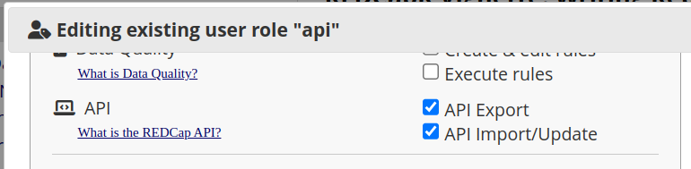

```{r setup, echo = FALSE}
knitr::opts_chunk$set(include = TRUE)

source("./assets/color_funs.R")

xaringanExtra::use_tile_view()
```

```{r jquery, echo=FALSE}
# This is to deal with issues when making slides.
# See: https://github.com/jhelvy/xaringanBuilder/issues/46
#htmltools::tagList(rmarkdown::html_dependency_jquery())
```

```{r, eval=FALSE, echo=FALSE}
# make pdf of slides
# remotes::install_github("jhelvy/xaringanBuilder")
xaringanBuilder::build_pdf("./write-to-server.Rmd")
```

```{r, echo=FALSE}
library(knitr)
# remotes::install_github("hadley/emo", quiet = TRUE)
```

# Final Leg

---
# Uploading vs Downloading?

+ Writing data _to_ REDCap is more difficult than reading data _from_ REDCap.
+ When you read, you receive data in the structure that the REDCap provides you.
+ You have some control about the columns, rows, and data types,
  but there is not a lot you have to specify to avoid errors.
+ In contrast, the structure of the dataset you send to the REDCap server must be precise.
+ You need to pass special variables so that the REDCap server understands the
  hierarchical structure of the data points.

---
If you are new to REDCap and its API,
please first understand the concepts described in these two REDCapR [vignettes](https://ouhscbbmc.github.io/REDCapR/articles/):

* [Typical REDCap Workflow for a Data Analyst](https://ouhscbbmc.github.io/REDCapR/articles/workflow-read.html) 
  (essentially everything in this workshop until now)
* [Retrieving Longitudinal and Repeating Structures](https://ouhscbbmc.github.io/REDCapR/articles/longitudinal-and-repeating.html)

---
# REDCapR

+ Uses the [httr](https://httr.r-lib.org/) (which uses curl) to interact with a REDCap server.
+ In a sense, REDCapR's goal is to directly translate data between REDCap's MariaDB and R's `data.frame`.  
+ Packages like [tidyREDCap](https://CRAN.R-project.org/package=tidyREDCap), [REDCapTidieR](https://CRAN.R-project.org/package=REDCapTidieR), & [REDCapDM](https://CRAN.R-project.org/package=REDCapDM) take it a step further for facilitating important tasks.
+ Currently, there haven't been any second-level efficiencies developed for uploading, so we'll use REDCapR.
+ For a list of all the packages (not just R packages), see  [REDCap Tools](https://redcap-tools.github.io/projects/) (<https://redcap-tools.github.io/projects/>).
+ A part of this presentation requires the most recent version (that's not yet on CRAN): `remotes::install_github("OuhscBbmc/REDCapR")`

---
# Token Permission

+ Make sure the "API Import/Update" box is checked by the project admin.

.center[]

+ Within REDCapR documentation, "import" means the client is uploading/writing to the server.  (Some packages define it differently.)